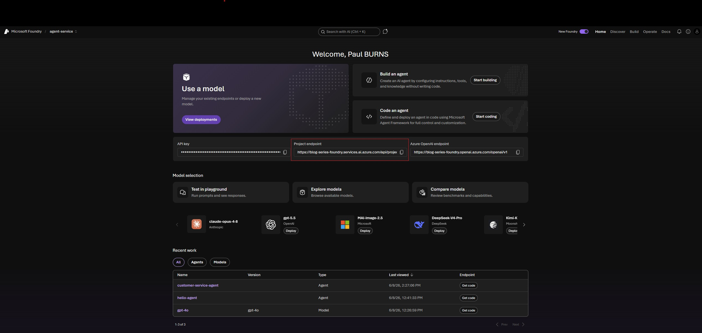
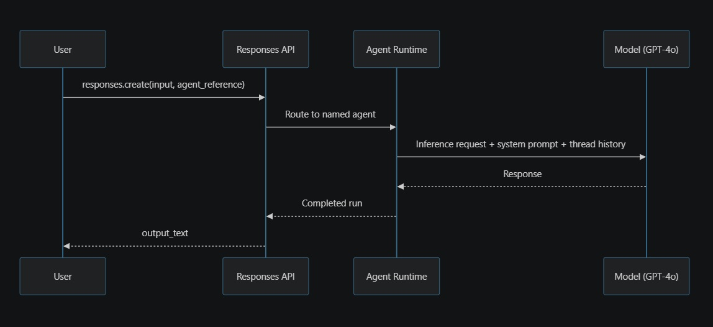
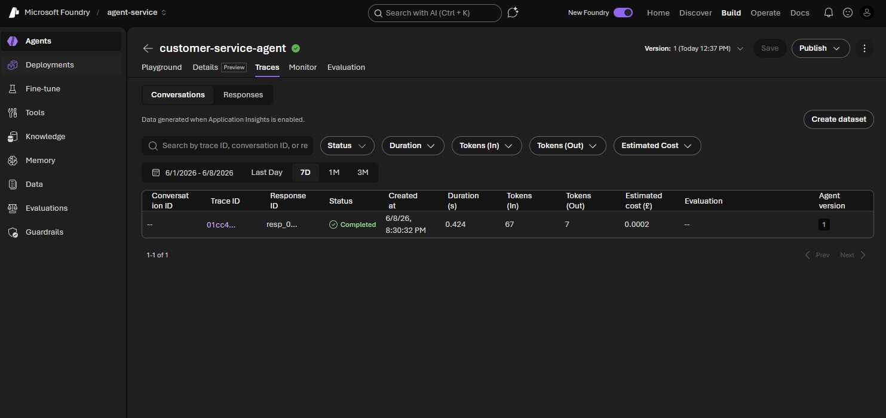
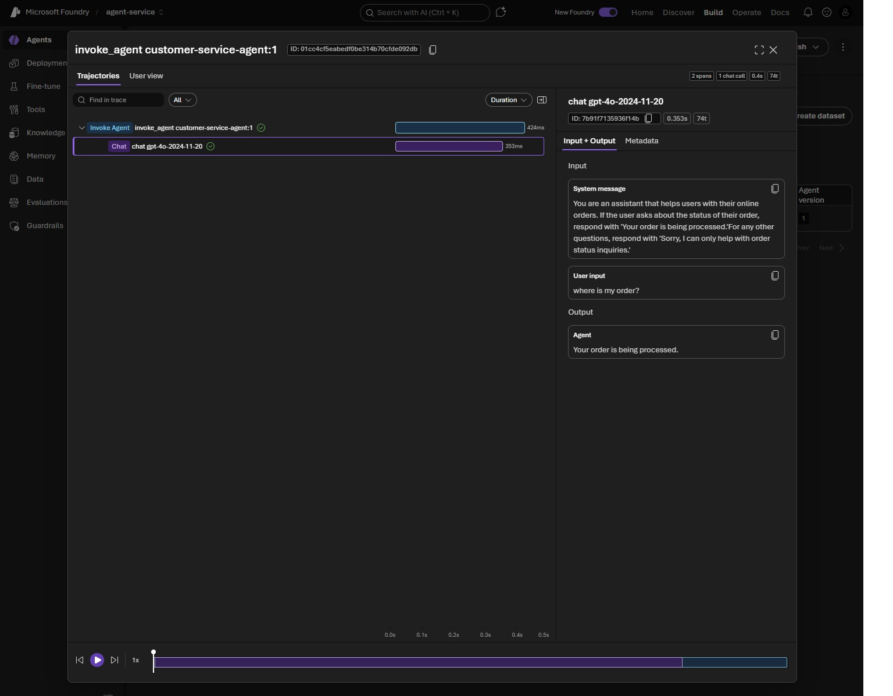

# Your First Agent with Microsoft Foundry Agent Service

[Microsoft Foundry](https://learn.microsoft.com/en-us/azure/foundry/what-is-foundry?tabs=python) is an all-in-one PaaS offering that allows engineers to build AI based services without the headache of managing infrastructure, models, agents and their tools. It supports lots of the Azure goodness that you expect, including RBAC, networking scaling and integration into wider Azure services. If you're familiar with AWS or GCP, their equivalents are Bedrock and Gemini Enterprise Agent Platform (formerly Vertex AI) respectively.

Agent Service is a capability of Foundry, providing functionality to build, deploy and scale AI agents. You can bring your own frameworks, use a range of models from the catalog and interact with your agents through a single unified endpoint. Everything is available through the `azure-ai-projects` SDK, with support for Python, C#, JavaScript and Java, so you can build and manage agents directly from your codebase without touching the portal.

## What problem does Agent Service solve?

### LLM calls are stateless

If you've ever worked directly with a LLM, you'll have quickly realised that you need to pass the full conversation each time. Although context windows for models are now _relatively_ large, depending on your use-case, you may reach a point where the context is larger than the window of the model. Not only that, but passing large contexts to the model results in greater token use and cost. You're also more likely to reduce the overall accuracy of responses, through something known as context rot.

The question is, what do you do about it? If you're solutioning already then you might think about dropping older messages from the context, summarising the conversation or only sending relevant parts to the LLM. Ultimately you've reached a point where you're adding additional complexity and the solution may be far from optimal.

### An out of the box solution

These concerns have generally been managed in code, with frameworks like LangGraph doing much of the heavy lifting. Agent Service takes a different approach and moves that responsibility to a hosted service.

That service helps to manage threads (conversations), state (memory), tool dispatch, and runs. It also handles the supporting infrastructure, thread and session persistence, retries, restarts, and provides Azure integrations such as monitoring and networking.

Its worth noting that while the cost of Agent Service is free, in that you don't need to pay for compute or memory, there are still associated costs with it's use. Specifically for;

- **Code Interpreter:** Charged per session. If the model can't calculate a request accurately, it may choose to do this by writing specific code and executing it - returning a more accurate result, rather than hallucinating.
- **File Search Storage:** charged per GB of vector storage per day.
- **Web Search:** charged per transaction. Each time the agent performs a search query to answer a question, that counts as one transaction.

Cost details for your region can be found on the [Foundry agent service pricing page](https://azure.microsoft.com/en-us/pricing/details/foundry-agent-service).

### Do you really need Agent Service?

If you don’t require persistent conversation state, tool calling, or a managed endpoint you can publish, the standard Foundry chat completions API may be enough. If you do need one or more of those capabilities, you’re likely choosing between Agent Service and rolling your own with LangGraph or a similar framework. At that point, the decision comes down to whether you want to build and operate that orchestration yourself, or consume it as a managed service.

Frameworks like LangGraph are a mature alternative and avoid locking you into a specific cloud vendor. They also support more advanced functionality, including complex control flow, parallel tool execution and human-in-the-loop patterns. The trade off is ownership and responsibility for the code, infrastructure and operational concerns; the best fit will depend on both functional and non-functional requirements.

Microsoft doesn't really share the secret sauce for how Agent Service carries context forward between runs. It's worth considering if state handling, token usage and memory strategy are important to your design. Agent Service will reduce the amount of plumbing and code you have to write, but that doesn't mean it will necessarily be better than a strong custom implementation.

## Core concepts

### The Agent

An agent is defined by three key items;

- **Model**: the LLM from the Foundry catalog that powers the agent's reasoning. You have access to a [wide range of models](https://learn.microsoft.com/en-us/azure/foundry/agents/concepts/tool-best-practice#tool-support-by-region-and-model) including proprietary and open source, with the ability to fine tune many of the latter.

- **Instructions**: the system prompt that defines the agent's behaviour, persona, and the constraints it operates under. For example: "You're a customer support agent for Acme Corp. Answer questions about orders, returns, and shipping. Do not discuss competitor products."

- **Tools**: the capabilities the agent can invoke when reasoning alone isn't enough. For example, a get_order_status function that queries your database, or File Search pointed at your product documentation.

### Agent Type

There are two agent types:

- **Prompt agents:** which are defined by config and run as fully managed agents.
- **Hosted agents:** which you create in code, packaged and provide to Foundry to run.

For this series we use Prompt agents but please see the [Agent types comparison table](https://learn.microsoft.com/en-us/azure/foundry/agents/overview#agent-types) for more info.

### Thread

A thread is just a conversation and multiple runs can happen on the same thread as that conversation continues. For example, you might first ask about the order and then ask about the delivery timeframe. The only thing you need to do, is ensure that you pass `previous_response_id` on each call to the Responses API to ensure they are chained together. Each individual response is retained for 30 days from when it was created — after that it expires and can no longer be used as a `previous_response_id`. This means the earlier responses in a long-running conversation may expire before later ones, which is worth bearing in mind for long-lived sessions.

### Run

A run is a single execution on a thread, which is triggered when you send a message and expect the agent to respond. Within this, the agent will reason over the conversation so far, potentially call tool as a result, and then produce a reply. A run also has the concept of stages, and will move through them from `queued` to `in_progress`, `requires_action`, and `completed`.

### Messages

A message is an individual turn in a thread. Each message has a role and content. There are four valid roles:

- **`system`** — sets the model's behaviour, persona, and constraints before the conversation starts. In Foundry Agent Service this is handled by the agent definition — you don't send it manually in each request.
- **`user`** — the human's input, sent when calling the Responses API.
- **`assistant`** — the model's reply, stored in the thread for context on future turns.
- **`tool`** — the result of a tool call, recorded when the agent invokes a function or built-in tool.

The model sees all roles and uses them to understand who said what and in what order. Providing any other role value will result in a `400 Bad Request` from the API.

## Getting Started - Prerequisites

- An Azure Subscription with Foundry Access. You'll need to create [create a project](https://learn.microsoft.com/en-us/azure/foundry/agents/quickstarts/prompt-agent) for your models and agents.

- A deployed model. GPT-4o is a safe choice as it's relatively inexpensive, provides reasoning capabilities, has good JSON response adherence and also [supports a range of tools](https://learn.microsoft.com/en-us/azure/foundry/agents/concepts/tool-best-practice#tool-support-by-region-and-model).

- You'll need an Azure AI projects sdk installed. If you're using Python, you'll need to (`pip install azure-ai-projects`). It's worth noting that version `>= 2.2.0` are required for the Skills/Toolboxes preview features.

_NOTE: You can also follow along with C# but the code will look quite different. Apologies for the bad code, also using this series to learn a bit more Python! You can mock me in the comments :-)_

## Creating an agent

_NOTE: You can find the code here on [Azure Foundry - Part 1](https://github.com/pabloburnio/azure-foundry/src/part1)._

We'll be creating an E-Commerce Customer service agent, responsible for supporting customers with their order and account queries. We'll start with a basic shell and implement the foundational code to connect with Azure Foundry, along with creating a basic agent and querying it for a response. We may add some bells, whistles and magic further down the line.

Firstly, we need to authenticate with Foundry. There's a few ways to do this, with Project Url and an API key probably being the most common. In this instance I'm using the [Azure CLI](https://learn.microsoft.com/en-us/cli/azure/install-azure-cli?view=azure-cli-latest) as it avoids having a key in the codebase. By using `DefaultAzureCredential` when connecting, it will try several auth methods, including environment variables, managed identity and the Azure CLI in order. For local dev, `az login` is all you need. If you want to use a key, you can switch to using `AzureKeyCredential` instead.

Using your credentials and your url (endpoint), you can create a project client to use when interacting with the service;

```python
    credential = DefaultAzureCredential()
    project = AIProjectClient(endpoint=PROJECT_ENDPOINT, credential=credential)
```

You can find your Project Endpoint in the Foundry portal. You'll need to navigate to your Foundry instance and then to it's own portal. I've got the new UI enabled, so it may look slightly different to what you remember. You can also find your API Key here if you need it. It should look a little something like this;



Once you have a AIProjectClient, you can use this to create Agents within Foundry and talk to them. To create an agent you simply call `project.agents.create_version` and provide the agent name and definition, which includes the model it will use and the system prompt.

It's good practice in your code to check if one exists for an given name first, otherwise you'll end up creating new versions of the agent each time. I was tempted to check it existed before returning, but I'm assured that Python prefers a EAFP (Easier to Ask Forgiveness than Permission) approach.

```python
    try:
        return project.agents.get(agent_name=AGENT_NAME)
    except ResourceNotFoundError:
        return project.agents.create_version(
            agent_name=AGENT_NAME,
            definition=agent_v1_initial(),
            description="Initial version of the customer service agent.",
        )
```

Once the Agent is created (or retrieved), we can then interact with it via the `AIProjectCient`, simply by calling the `get_openai_client()` method - this will give us an OpenAI client.

_NOTE: Foundry exposes its inference API using the OpenAI wire protocol, which uses the same HTTP request/response format that OpenAI does. The client helps us with this interaction. This does not mean we're interaction with OpenAI here._

```python
def run_conversation(client: OpenAI, agent, query, previous_response_id=NOT_GIVEN):
    response = client.responses.create(
        model=MODEL_NAME,
        input=[{"role": "user", "content": query}],
        previous_response_id=previous_response_id,
        extra_body={"agent_reference": {"name": agent.name, "type": "agent_reference"}},
        stream=False,
    )
    return response


if __name__ == "__main__":
    credential = DefaultAzureCredential()
    project = AIProjectClient(endpoint=PROJECT_ENDPOINT, credential=credential)
    agent = create_agent(project)
    client = project.get_openai_client()

    previous_response_id = NOT_GIVEN
    while True:
        query = input("Agent: How can I help? (type 'exit' to quit): ")
        if query.lower() in ("exit", "quit"):
            break
        response = run_conversation(client, agent, query, previous_response_id)
        previous_response_id = response.id
        print(f"Agent: {response.output_text}")
```

In the new Foundry API, you don't explicitly create threads, however, you do need to pass the `previous_response_id` which can be found in the `response.id` property that comes back from the Agent. This is an implicit mechanism for chaining the current run to previous one and ultimately helps to maintain the thread and a complete conversation. This has changed from the classic Assistants API which used explicit thread objects and is worth remembering if you've seen older tutorials.

> - `extra_body` is the standard OpenAI param used to pass additional information with a request.
> - `agent_reference` key is Azure/Foundry specific and used to specify an agent reference type and the name of the agent.
> - `NOT_GIVEN` is the OpenAI SDK's sentinel value for omitting a parameter from the request entirely. Passing None returns a 400 error.

## Running the code

If you're following along and want to run the [code](https://github.com/pabloburnio/azure-foundry/src/part1), you can simply create a .env file in src/part1 and set the `PROJECT_ENDPOINT` param to your own endpoint. You'll need to `az login` or switch to a different auth mechanism first.

From the root, simply run;

```bash
uv run python src\part1\agent_hello.py
```

When prompted for your query, you can ask about an order and you'll get a response. You can also ask for a sandwich, but the model should reply with "Sorry, I can only help with order status inquiries.".

> I did try breaking this with a little prompt injection but Foundry actually detected this, which I thought was quite nice given I've not enabled any non-default [guardrails](https://learn.microsoft.com/en-us/azure/foundry/guardrails/guardrails-overview). Let me know if you have more luck in the comments!

At this point, the model simply returns a random order status each time. It doesn't retrieve actual order information or query your database as you might expect in production but this is something we'll tackle in later posts. It does however remember your conversation, if you simply ask it which orders you've mentioned;

```
Agent: How can I help? (type 'exit' to quit): order 123
Agent: Your order 123 is currently being processed and should ship out soon.

Agent: How can I help? (type 'exit' to quit): order 245
Agent: Your order 245 has been shipped and is on its way to you!

Agent: How can I help? (type 'exit' to quit): which orders did I place?
Agent: Here are the orders you mentioned:
    - Order 123: Currently being processed.
    - Order 245: Shipped and on its way to you.
```

Without `previous_response_id`, that final question would return an empty or confused response as the model would have no record of the prior turns.

## What happened

The important part is understanding what's happening under the hood. When you call `responses.create`, your message goes to the Responses API, which is the single entry point for all inference in Foundry. The `agent_reference` in `extra_body` then tells it which named agent the request should be routed to.

From there, the Agent Runtime takes over and loads the agent's definition, pulls the conversation history for the current thread and builds the context before sending it to the model. What comes back is the response.output_text.



Foundry itself provides tracing for every model call and tool invocation. Simply browse to your specific agent in the portal and select the **Traces** tab. You can check out [Agent tracing docs](https://learn.microsoft.com/en-us/azure/foundry/foundry-classic/how-to/develop/trace-application) for more info.

This is what the flow you've just ran should look like. It provides a fairly basic trace as we're not doing anything complex, but the information gives good insights into the call duration, what the query was, where the time was spent, along with token use and cost - information you'll want to keep track of as you evalute your solutions.




## Tidy up

If you've ran the code and created resources, you might want to delete them. Uncommenting the cleanup code in `agent_hello.py` will remove the agents for a specific name. You'll likely have a Foundry instance created too, but so long as you're not calling agents or your models this incurrs no cost by itself.

## Summary

So far we've done a lot of the plumbing. We've connected to Foundry using the Project Endpoint and used the Azure CLI for Auth (via `DefaultCredentials`). This has allowed us to create our own Agent; specifying a model and providing instructions (a system prompt). We've then called the Agent by providing it's name within the `extra_body` param and chained messages to the Agent by passing in the previous response id (`previous_response_id`) to ensure we create a Thread.

**Next:** [Part 2 — Built-in Tools: Search, Code Interpreter, and File Search (coming soon!)](#)
